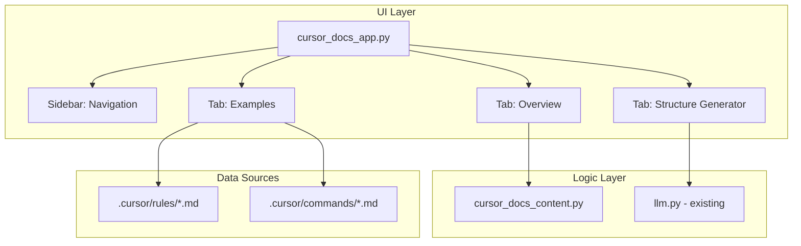

# Cursor Commands vs Rules Explainer App

## Overview

A standalone Streamlit application that educates developers on the differences between Cursor Commands and Rules, provides real examples from this project, and includes an interactive generator to help users create `project-structure.md` files for their own projects.

## Architecture



## File Structure

```
prompt_assistant/
├── cursor_docs_app.py        # NEW - Standalone app entry point
├── cursor_docs_content.py    # NEW - Content and definitions
├── llm.py                    # EXISTING - Reuse for AI generation
├── requirements.txt          # EXISTING - No changes needed
└── .cursor/
    ├── commands/
    │   └── code-review-checklist.md
    └── rules/
        ├── cursor-rules.md
        └── project-structure.md
```

## Implementation Details

### 1. Content Module: `cursor_docs_content.py`

Stores structured definitions and comparisons:

```python
RULES_VS_COMMANDS = {
    "rules": {
        "purpose": "Provide persistent context/guidance to Cursor AI",
        "location": ".cursor/rules/",
        "triggered_by": "File patterns (globs) or alwaysApply flag",
        "format": "Markdown with YAML frontmatter",
        "use_cases": ["Coding standards", "Project structure", "Architecture guidelines"]
    },
    "commands": {
        "purpose": "Execute specific actions on demand",
        "location": ".cursor/commands/",
        "triggered_by": "/slash-command in Cursor chat",
        "format": "Plain markdown with instructions",
        "use_cases": ["Code reviews", "Start/stop services", "Generate boilerplate"]
    }
}
```

Functions to include:

- `get_comparison_table()` - Returns markdown table comparing Rules vs Commands
- `get_rule_frontmatter_docs()` - Documents the frontmatter fields
- `load_example_files()` - Reads actual .md files from `.cursor/` folder
- `get_project_structure_template()` - Returns a template for project-structure.md

### 2. Main App: `cursor_docs_app.py`

Three-tab interface:

**Tab 1: Overview**

- Visual comparison table (Rules vs Commands)
- When to use each
- Directory structure diagram
- Key differences highlighted

**Tab 2: Live Examples**

- Loads and displays actual files from this project:
  - [`.cursor/rules/cursor-rules.md`](.cursor/rules/cursor-rules.md) - Meta rule about rules
  - [`.cursor/rules/project-structure.md`](.cursor/rules/project-structure.md) - Always-apply example
  - [`.cursor/commands/code-review-checklist.md`](.cursor/commands/code-review-checklist.md) - Command example
- Syntax highlighting with annotations explaining each part
- Frontmatter field explanations

**Tab 3: Project Structure Generator**

- Form inputs: project name, tech stack, main files, architecture notes
- Uses existing [`llm.py`](llm.py) with LangChain to generate a `project-structure.md` file
- Preview and copy functionality
- Falls back to template-based generation if no API key

### 3. Reuse Existing [`llm.py`](llm.py)

Leverage the existing LangChain integration:

- `get_llm()` for model instantiation
- `create_prompt_chain()` pattern for the structure generator
- New function: `generate_project_structure()` with a specialized prompt

### 4. UI Design

- Clean, educational layout with callouts and info boxes
- Consistent with existing app styling
- Expandable code blocks for examples
- Copy-to-clipboard for generated content
- Dark/light theme support via Streamlit config

## Key Features

1. **Side-by-Side Comparison** - Clear table showing Rules vs Commands differences
2. **Real Examples** - Loads actual project files, not fabricated examples
3. **Interactive Generator** - AI-powered project-structure.md creation
4. **Educational Annotations** - Explains frontmatter fields, globs, alwaysApply
5. **Copy-Ready Output** - One-click copy for generated files

## Running the App

```bash
streamlit run cursor_docs_app.py
```